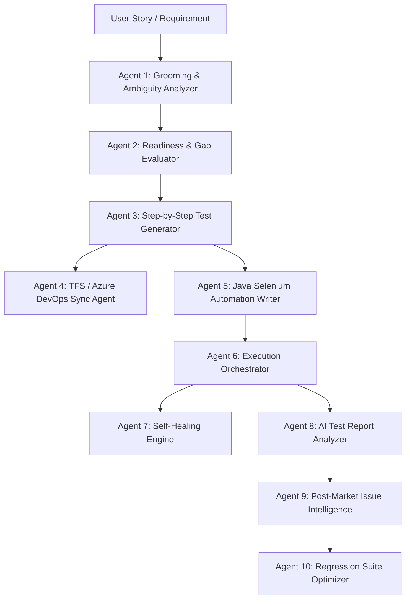

# QA Lifecycle Agents Platform 🤖🧪

> **Autonomous Multi-Agent AI System for End-to-End Software Quality Assurance & Testing Lifecycle**

An enterprise-grade, browser-based multi-agent orchestration platform designed to automate and augment the complete QA & Test Automation lifecycle across requirements analysis, test planning, Java Selenium automation generation, execution orchestration, self-healing, post-market surveillance, and test suite optimization.


---

## 🔒 Data Privacy & Zero-Tracking Guarantee

> [!IMPORTANT]
> **100% Client-Side Local Processing**
>
> All requirement parsing, user story analysis, TFS/Azure DevOps API parameter loading, and Java Selenium script generation are executed **entirely locally inside your browser** using deterministic NLP algorithms and client-side heuristics.
>
> - **Zero External Telemetry:** No user stories, PRDs, API tokens, test credentials, or parameters are stored, tracked, or sent to third-party databases or cloud LLM servers.
> - **Enterprise Security Safe:** Enterprise teams can safely load internal proprietary specifications, confidential acceptance criteria, and corporate TFS/ADO payload configurations without data leak risks.

---

## 🌟 The 10 Specialized QA Agents



### 1. 🔍 Requirement Grooming & Ambiguity Analyzer
- Analyzes raw user stories against INVEST principles.
- Evaluates clarity, acceptance criteria completeness, dependency mapping, and testability.
- Generates an instant **Readiness Score (out of 10)** with granular gap identification.

### 2. ⚖️ Evaluation & Gap Fulfilment Agent
- Validates revised user stories against strict edge-case coverage criteria.
- Guarantees boundary conditions, negative flows, concurrency, and security considerations are met before sign-off.

### 3. 📝 E2E Test Case Generator
- Synthesizes end-to-end user journey test cases (from Authentication to Teardown).
- Generates preconditions, granular steps, expected outcomes, test data variations, and priority tags.
- Categorizes tests across Positive, Negative, Boundary, Security, and Performance.

### 4. ☁️ TFS / Azure DevOps Test Plan Uploader
- Direct REST integration with Azure DevOps / TFS API.
- Publishes generated test suites directly to Test Plans & Test Suites.
- Automatically creates traceability links (`Tested By` links on source User Stories).

### 5. ☕ Java Selenium Automation Script Writer
- Generates clean, robust, production-ready Java automation scripts.
- Uses **Page Object Model (POM)** and PageFactory patterns.
- Includes explicit `WebDriverWait` strategies, TestNG annotations (`@Test`, `@DataProvider`), assertions, and ExtentReports logging.

### 6. 🚀 Test Execution Orchestrator
- Dispatches and monitors distributed automation runs across browser targets (Chrome, Firefox, Edge, Headless).
- Real-time step execution console with live status broadcasting and failure interception.

### 7. 🩹 Self-Healing Automation Engine
- Detects runtime element lookup failures (`NoSuchElementException`, `StaleElementReferenceException`).
- Employs dynamic fallback heuristic ranking (XPath axes, CSS tokens, ARIA roles, text anchors, visual proximity).
- Auto-patches broken locators on-the-fly and logs healing telemetry.

### 8. 📊 AI Test Report & Failure Categorizer
- Ingests TestNG / JUnit / Extent execution logs and screenshots.
- Categorizes test failures into: **Product Defect**, **Locator Flakiness**, **Environment / Network Timeout**, or **Test Data Issue**.
- Generates Root Cause Summaries and one-click Jira/Azure bug drafts.

### 9. 🏥 Post-Market Escalation (PME) Intelligence
- Analyzes production customer escalations, support tickets, and field crash reports.
- Correlates live issues with existing test repositories to identify QA escape blind spots.
- Auto-generates high-yield regression test cases to prevent recurrence.

### 10. 🎯 Regression Suite Optimizer
- Analyzes code change diffs, code churn hotspots, and historical failure frequencies.
- Applies risk-based test selection algorithms to generate an optimized **Smoke (15 min)**, **Sanity (1 hour)**, or **Full Regression** sub-suite.

---

## 🛠️ Technology Stack & Design

- **Frontend Core**: Vanilla HTML5, High-Performance ES6+ Modular JavaScript
- **Styling Architecture**: Custom CSS Glassmorphism Design System, CSS Variables, Responsive Grid & Flexbox, Fluid Micro-Animations
- **Integration Targets**: 
  - Java / Selenium WebDriver / TestNG / Maven
  - Azure DevOps REST API / TFS Test Manager
  - Jira Software Cloud API
  - Playwright / Chromium WebDriver Bridge

---

## 🚀 Getting Started

### Local Setup (Instant Zero-Config)

1. Clone the repository:
   ```bash
   git clone https://github.com/sahilapte/qa-lifecycle-agents.git
   cd qa-lifecycle-agents
   ```

2. Start any local static server:
   ```bash
   # Using Python 3
   python3 -m http.server 8090

   # Or using Node / npx
   npx serve .
   ```

3. Open your browser and navigate to:
   ```
   http://localhost:8090
   ```

---

## 💻 Agent Workflow Showcase

```
User Story ───► [Grooming Score: 8.5/10] ───► [Evaluation: APPROVED]
                                                       │
                                                       ▼
[Java Selenium POM Generated] ◄─── [18 Detailed Test Cases Generated]
            │                                          │
            ▼                                          ▼
[Execution & Self-Healing] ──► [AI Report Analysis] ──► [TFS / Azure DevOps Synced]
```

---

## 👤 Author

**Sahil Apte**
- GitHub: [@sahilapte](https://github.com/sahilapte)
- Email: sahilapte14@gmail.com

---

## 📄 License

This project is licensed under the MIT License - see the [LICENSE](LICENSE) file for details.
